# WiFi Controlled Strip Lighting

Control some dazzling RGB effects with ESP8266 and Vue.js Web App! Want to decorate your loungeroom or living areas with cool lighting effects from your mobile phone? With this kit you can!

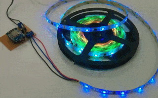

This is also a useful tutorial if you want to extend and join multiple [SL3954](https://jaycar.com.au/p/SL3954) lights together.

| Input        | Output               |
| ------------ | -------------------- |
| WiFi Control | Pretty Light Effects |

## Table of contents

- [WiFi Controlled Strip Lighting](#WiFi-Controlled-Strip-Lighting)
  - [Table of contents](#Table-of-contents)
  - [Bill of Materials](#Bill-of-Materials)
    - [You might also want](#You-might-also-want)
  - [Software & Libraries](#Software--Libraries)
  - [Systems Overview](#Systems-Overview)
    - [Current Effects](#Current-Effects)
    - [ESP8266 Configuration](#ESP8266-Configuration)
      - [Before you begin](#Before-you-begin)
      - [Board Settings](#Board-Settings)
    - [Controller Board Layout](#Controller-Board-Layout)
    - [Web App](#Web-App)
    - [Strip Lights SL3954](#Strip-Lights-SL3954)
  - [Integration](#Integration)
  - [Use](#Use)
    - [File not found, (Did you upload files correctly?)](#File-not-found-Did-you-upload-files-correctly)
  - [Future Improvements](#Future-Improvements)
  - [Further Reading](#Further-Reading)
    - [ESP SPIFFS / Webhost](#ESP-SPIFFS--Webhost)

## Bill of Materials

| Qty | Code                                     | Description            |
| --- | ---------------------------------------- | ---------------------- |
| 1   | [SL3954](https://jaycar.com.au/p/SL3954) | Strip Light            |
| 1   | [XC3802](https://jaycar.com.au/p/XC3802) | ESP8266 board          |
| 1   | [ZT2400](https://jaycar.com.au/p/ZT2400) | 2N7000 FET             |
| 1   | [RR2774](https://jaycar.com.au/p/RR2774) | 1k resistor            |
| 1   | [ZV1505](https://jaycar.com.au/p/ZV1505) | 7805 Regulator         |
| 1   | [RE6070](https://jaycar.com.au/p/RE6070) | 10uF capacitor         |
| 1   | [RZ6627](https://jaycar.com.au/p/RZ6627) | tantalum 1uF capacitor |
| 1   | [HP9556](https://jaycar.com.au/p/HP9556) | PCB board              |
| 1   | [HM3172](https://jaycar.com.au/p/HM3172) | 2 way terminal         |
| 1   | [HM3173](https://jaycar.com.au/p/HM3173) | 3 way terminal         |

### You might also want

- [Heatshrink](https://jaycar.com.au/p/WH5525) to tidy up the strip light joints and protect them. ( Glue'd [WH5643](https://jaycar.com.au/p/WH5643) is a good choice as well)
- Some [PCB dc power sockets](https://jaycar.com.au/p/PS0519), so you can use the power supply in the strip lighting kit.
- Some [hookup cables](https://jaycar.com.au/p/WH3009).

## Software & Libraries

- You will need the [ESP Data Upload Tool](https://github.com/esp8266/arduino-esp8266fs-plugin) to upload the phone website data onto the ESP.
- We _ARE_ using the Adafruit NeoPixel Library; however it has to be modified due to the use of the 2n7000 FET, which inverts the signal. You won't have to install it manually as it is already in the sketch folder for this project.
  - If you really want to know the change; we swapped `line 65` and `line 72` of **esp8266.c**, so instead of `HIGH` it writes `LOW` and vice-versa.

## Systems Overview

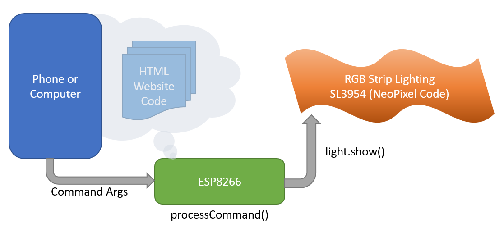

More or less a simple system conceptually; the esp provides a *website* that shows up like a makeshift Web-App on your phone. When you use the app to set the speed and colour of the strip lighting, the ESP will then process the parameters and activate the effects.

### Current Effects

So far the effects we have done (as of 20/09/2019) are:

- Solid:
  - Single Colour
  - Half-n-Half (alternate)
  - Fade one to other (mix)
- Rainbow:
  - (Cycles through colours, so Colour Options doesn't make sense)
- Fade: **(TODO)**
  - Mix: Fade between one to the other; Red->Purple->Blue;
  - Alternate: Fade alternatively, to black; Red->Black->Blue;
- Strobe: **(TODO)**
  - Mix: Flash with every second LED as the second colour;
  - Alternate: Half-n-half Strobe effects alternating flashes;
- More? **What effects do you want to see?**

Check the github repository for the latest: [@Jaycar-Electronics/WiFi-Controlled-Strip-Lighting](https://github.com/Jaycar-Electronics/WiFi-Controlled-Strip-Lighting)

For this example we have 2 effects done; but we want more. Pull requests and code improvements through Github are well recommended and is a great way to learn. Contribute what you want, the worst we can do is correct it and send it back.

### ESP8266 Configuration

The main work of this project involves the ESP8266 controller board

#### Before you begin

The [XC3802](https://jaycar.com.au/p/XC3802) main board is used and has its own manual on how to enable it in the Arduino IDE; be sure to read and apply that first before trying to program the ESP; you can go do that now and come back to this project at any time :smiley:.

#### Board Settings

We are using pin `D7` to control the Strip lighting; A quick point of reference (for the programming segment later): `D7` is not accessed through the literal number `7` but instead by the designator `D7`.

Thus:

```cpp
pinMode(D7, OUTPUT);
digitalWrite(D7, HIGH);
digitalRead(D7);
```

The literal `D7` is only defined via the `LOLIN(WEMOS) D1 R2 & Mini` board setting, in the `Tools->Board` menu of the Arduino IDE.

In addition to this; we are storing our website on the ESP in flash memory, so we must use `<SPIFFS.h>` library which is included in the board management from above.

You should make sure you remember to set the flash size in the board settings, for this project we use **`4M (3M SPIFFS)`** size.

- Tools
  - Board : WeMos D1 R2 & Mini
  - Flash Size: 4M (3M SPIFFS)
  - Port: (The port your ESP is connected to)

The circuit is a simple one; as we are using 12v source (as needed by the lights) we pass that through to the light circuit, and use a small [2n7000 FET](https://jaycar.com.au/p/ZT2400) to control the `DIN` line to the striplight.

### Controller Board Layout

The general schematic is like this; note the orange wire.

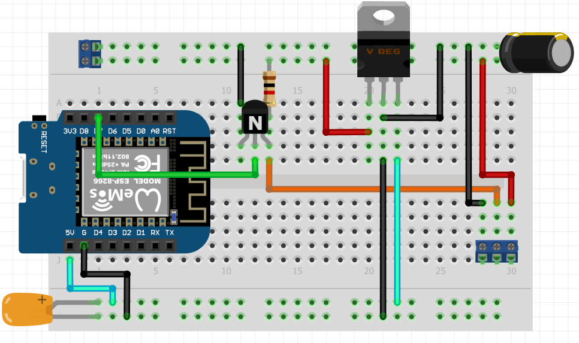

Above: _breadboard version_

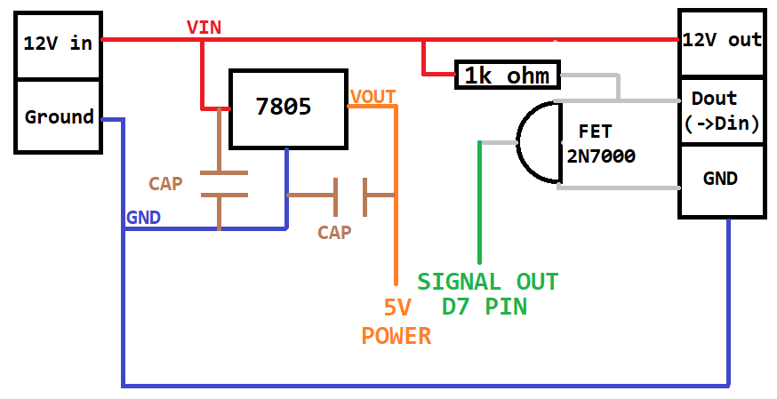

It might start to look complicated but this is quite a simple circuit to pay attention to:

- 12V comes in via the connector on the left, with the top rail being +12v and the other being ground.
- 12V flows across the board to the other connector
- GND follows around the underside of the board, and connects to the connector.
- The middle `SIGNAL-OUT` connects to the top pin of the FET; and has the resistor between it and 12V.
- the middle pin of the FET connects to D7 on the ESP8266.
- There is a 7805 circuit that powers the ESP8266; this is a simple `VIN, VOUT` circuit, with capacitors on each of side.

Depending on the PCB / veroboard that you've chosen to use for this project will determine how it's laid out; however if you're going with this tutorial and you're using the PCB board that we've supplied, you might find something a little bit like this:

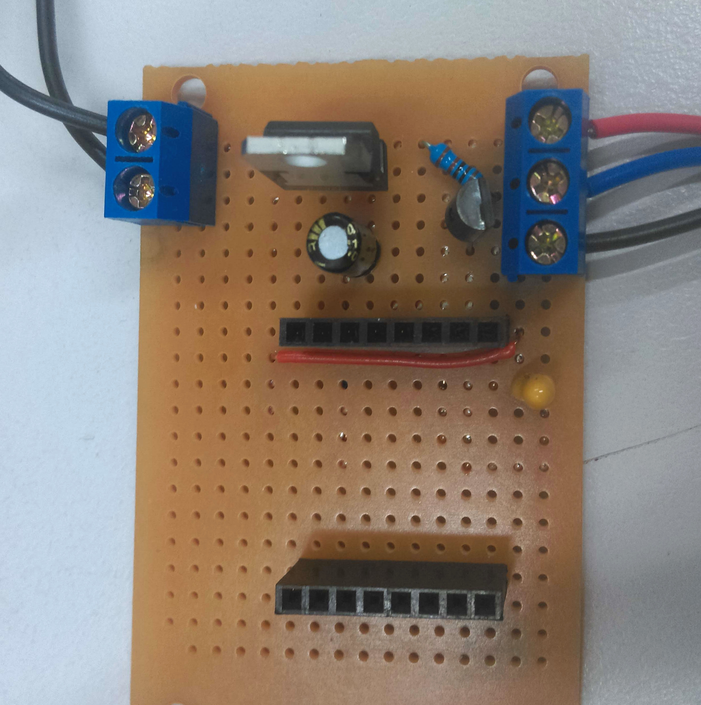

Given the connections on the underside of the board, there's a bit of work to get it so that it is not shorting itself out. Below is some photos of our board to help you, but try to follow along to make sure that things are connected as they should be. Haste makes waste.

The last photo of this segment is flipped so that you can see how it corresponds to whats under the board; make sure you do not copy this image, it is just for reference so you can visualise where each connection is going.

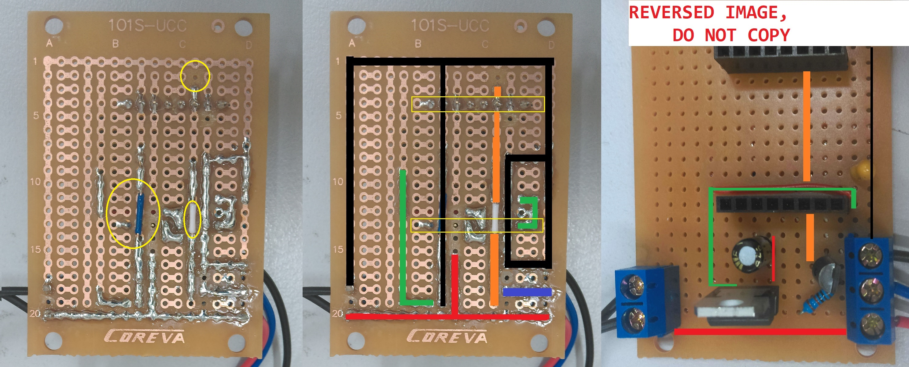

Follow the advice below so you can visualise it better; Note that there are bridges on both the **ORANGE** and **BLACK** lines, so that they are not connected the pins underside. This is important and are highlighted in the yellow circles on the first image.

| Colour | Circuit                                                                                      |
| ------ | -------------------------------------------------------------------------------------------- |
| Black  | Ground connection                                                                            |
| Red    | 12V connection, connected to capacitor                                                       |
| Green  | 5V connection, coming out of 7805 chip                                                       |
| Purple | Signal connection, resistor to 12v, coming from top pin of FET                               |
| Orange | ESP signal connection, connected to D7 and middle pin of FET, **Bridged over D4 connection** |

Below is a blank PCB that has had the correct traces cut; if you're still stuck you can copy this below by using a small knife to remove the traces, then simply place the above components and try to copy the above. If you are going your own way in regards to the PCB, just ensure to follow the images at the start of this section.

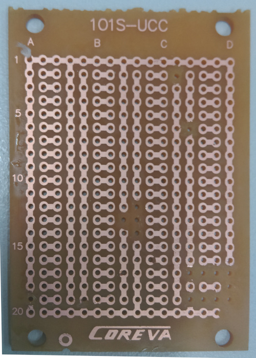

And finally, *please do not connect 12v to your ESP, on any pin.* Test and make sure with a multimeter that the `5V` pin is `5V`, and the other pins are not shorted.

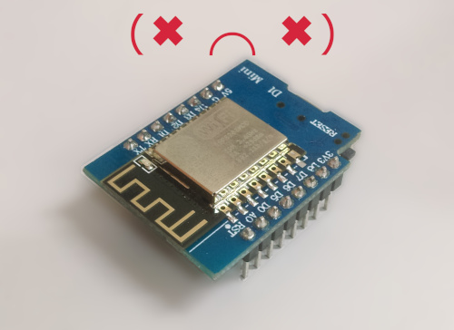

### Web App

The "_Web App_"/Website portion of the software is located in the data folder and is written in HTML/Javascript; It mainly uses the [Bootstrap Vue](https://bootstrap-vue.js.org/) library to make a visually pleasing interface.

Connecting the ESP to the network is a pretty easy process and we have simplified the parameter settings for you. We like this method and will continue it in future projects.

The parameters for connecting to your network is as follows:

```cpp
void setup(){
  //...
  setupNetwork("yourWifiName", "yourWiFiPassword");
  setupMDNS("NameOfYourDevice");
  //..
}
```

You can change `NameOfYourDevice` to any singular lower-case word, for instance: `loungeroom`, `coollights`, `prezzie`; you will then be able to access the device through:

```plain
http://nameofyourdevice.local/
```

If you have multiple devices, they must all have unique names.

You can simply use the [Data Upload Tool](https://github.com/esp8266/arduino-esp8266fs-plugin) and upload the data folder to the ESP; We won't explore too much into the web-programming side of it; but some points of reference:

- Bootstrap vue creates custom elements such as `<b-btn>` - read more about **components** on the bootstrap vue website.
- we use `jscolor.js` from <http://jscolor.com/> as a library to produce our colour picker; this has been [minified](<https://en.wikipedia.org/wiki/Minification_(programming)>) in our data folder.
- `controller.js` is the main javascript control application and is written in [vuejs](https://vuejs.org/)

### Strip Lights SL3954

The strip light is an easy 3 wire connection; You'll find them labeled as

- `VCC` - connected to 12V
- `DIN` - connected to DATA port
- `GND` - connected to ground

Simply snip off along the cut line, then use a stanley knife to trim away some of the waterproof coating.

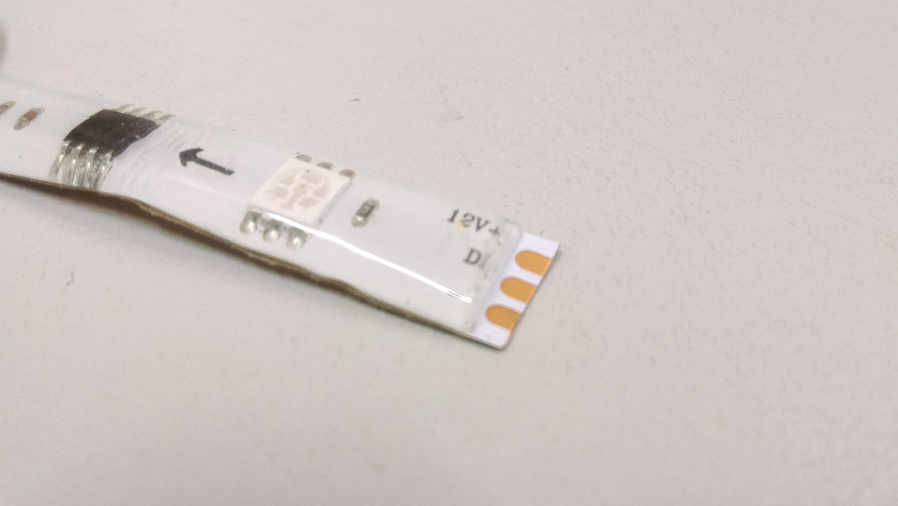

Once the copper pads are exposed; use a soldering iron to apply a blob of solder to the pad; you can then tin some wires and place them into the solder blob, so you have a nice solid connection. Be sure to colour code your wires so you know which one is which, this can be easily done with the [cable pack](https://www.jaycar.com.au/light-duty-hook-up-wire-pack-8-colours/p/WH3009) that we sell.

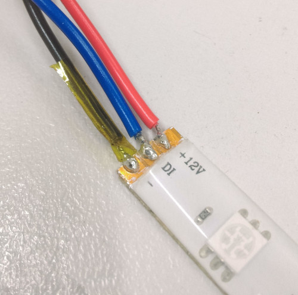

It will generally be a good idea to protect the joints with heatshrink if you have any available.

## Integration

Connect the strip-light into the `12V/DOUT/GND` port of the circuit board, then connect power into the `12V/GND` port of the circuit-board.

Test your connections, if you apply 12v to the ESP you will burn the chip out. As long as you're reading 5v on the 5v pin then you're fine: plug in the board, with the correct orientation.

Check your network, you should see the Striplighting hotspot show up and you can connect to it on your phone; OR if the device connected to your network, you can try `http://striplight.local` - depending on how you have it set up as mentioned in the "[Web App](#Web-App)" section.

## Use

Once things have been set up, simply open up up the website of the ESP and you should be greeted with a website that looks similar to below:

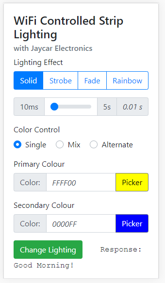

Here you will be able to change different effects, the rate of change, and most importantly, the colour and brightness. _(note: The rainbow effect will have no effect)_

### File not found, (Did you upload files correctly?)

This error is simply that the website has not been uploaded to the flash data; make sure that you set the correct flash size in the tools menu to `flash size` : `4M (3M) SPIFFS` and use the [ESP Data Upload Tool](https://github.com/esp8266/arduino-esp8266fs-plugin) to upload data to the SPIFFS of the ESP.

If you have changed the flash size in the tools menu, it would be best to re-upload the sketch so that the data is laid out correctly.

## Future Improvements

Definitely more effects, more options, more everything; this project has a huge avenue for improvement:

- More effects, the strobe and fade effects are still yet to be done
- The Web App could possibly be improved upon; preset colours, different tabs, etc.

## Further Reading

- <https://bootstrap-vue.js.org/>
- <https://learn.adafruit.com/adafruit-neopixel-uberguide/the-magic-of-neopixels>

### ESP SPIFFS / Webhost

- <https://tttapa.github.io/ESP8266/Chap11%20-%20SPIFFS.html>
- <https://circuits4you.com/2018/01/31/example-of-esp8266-flash-file-system-spiffs/>
- <https://randomnerdtutorials.com/esp8266-web-server-spiffs-nodemcu/>
